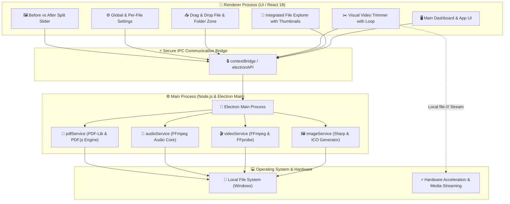

<div align="center">
  <br/>
  <br/>
  
  <br/>
  <br/>
  <p>
    🇺🇸 <strong>English Version</strong> | 🇧🇷 <a href="./README.md">Versão em Português</a>
  </p>
</div>

<br />

## 🌟 Overview

**MediaMorph** is a high-performance, open-source desktop application designed for **batch conversion, compression, video trimming, and manipulation of images, videos, audios, and PDF documents**. Built with **Electron 33**, **React 18**, **TypeScript**, **Tailwind CSS**, **Sharp**, and **FFmpeg**, MediaMorph provides 100% offline, local, and secure multimedia processing with native hardware acceleration.

Engineered for creators, developers, designers, and power users, MediaMorph combines an industrial-grade media engine with a clean, responsive interface featuring light/dark themes and a built-in file explorer.

<div align="center">
  
  
  
  
  
  
</div>

---

## ⚡ What You Can Do with MediaMorph

Below is the complete catalogue of all capabilities, features, and media operations available:

### 🖼️ 1. Images & Icons
- **Multi-Format Conversion & Compression:** Convert between **PNG, JPG/JPEG, WebP, AVIF, GIF, TIFF, BMP, SVG, and ICO**.
- **Lossy & Lossless Modes:** Slider for visual quality adjustment (1% to 100%) or mathematical lossless compression.
- **Native Windows Icon Generator (`.ico`):** Turn any image into a multi-resolution `.ico` icon file (256x256, 128x128, 64x64, 48x48, 32x32, 16x16) for executables and desktop shortcuts.
- **Scale & Resolution Resizing:**
  - Percentage-based scaling (*25%, 50%, 75%, 100%, 150%, 200%*).
  - Custom width and height inputs with aspect ratio lock.
- **Social Media & Web Presets:**
  - *Instagram Story / Reels (1080x1920 - 9:16)*
  - *Instagram Post / Feed (1080x1080 - 1:1)*
  - *Instagram Portrait (1080x1350 - 4:5)*
  - *YouTube Thumbnail (1280x720 - 16:9)*
  - *Twitter/X Header Banner (1500x500 - 3:1)*
  - *Twitter/X Post Image (1200x675 - 16:9)*
  - *Web Favicon (32x32)*
  - *Full HD (1920x1080) and 4K Ultra HD (3840x2160)*
- **EXIF Metadata Stripping:** Remove sensitive camera details, timestamp, and GPS locations for privacy.
- **Interactive Before & After Split Slider:** Side-by-side comparison modal with live zoom and real-time disk space savings.

---

### 🎬 2. Videos & Animations
- **High-Efficiency Video Encoding:** Convert videos between **MP4 (H.264), WebM (VP9), MKV, AVI, MOV, FLV, WMV, M4V, and 3GP**.
- **Animated GIF Creation:** Convert any video clip into a smooth, lightweight animated GIF.
- **Direct Audio Extraction:** Extract high-fidelity audio tracks directly from videos to **MP3**.
- **Smart Target File Size Presets:**
  - *Discord Free Uploads (25 MB / 8 MB limits)*
  - *WhatsApp Attachments (16 MB limit)*
  - *Email & Quick Sharing (50 MB limit)*
- **CRF (Constant Rate Factor) Controls:** Fine-tune video compression from CRF 18 (studio quality) to CRF 35 (extreme file shrinkage).
- **Video Downscaling:** Smart presets for *4K (2160p), Full HD (1080p), HD (720p), SD (480p), and 360p*.
- **Visual Video Trimmer:** Timeline scrubber with precise start/end handles, live video preview, and continuous loop playback strictly on the trimmed section.
- **One-Click Audio Stripping:** Export muted videos for social media feeds or presentation loops.
- **Instant Video Thumbnails:** Automatic frame preview extraction displayed in the file explorer and queue list.

---

### 🎵 3. Audio & Music
- **Audio Conversion:** Full support for **MP3, WAV, FLAC, AAC, OGG, M4A, WMA, and AIFF**.
- **Bitrate Customization:** Choose between *128 kbps (lightweight), 192 kbps (balanced), 256 kbps (high quality), and 320 kbps (studio master)*.
- **Channel Mixing:** Toggle between **Stereo** and **Mono** output.
- **Dynamic Volume Normalization:** Normalize loud or quiet audio tracks automatically.

---

### 📄 4. PDF Documents
- **Images ➔ Single PDF:** Merge and compile multiple photos/images into a single PDF document with custom page order and quality compression.
- **PDF ➔ Page Extraction to Images:** Load any PDF document and extract each page as a standalone image in **WebP, PNG, JPEG, AVIF, or TIFF**.
- **DPI Resolution Scaling for PDF Extraction:**
  - `1.0x (~150 DPI)` - Fast screen reading and quick preview.
  - `2.0x (~300 DPI)` - Print-grade crispness and sharp OCR text clarity.
  - `3.0x (~450 DPI)` - Ultra-high definition for technical drawings, architectural plans, and fine details.

---

### 📂 5. File Explorer, Queue & Productivity
- **Integrated File Explorer:** Browse local directories within the app with shortcuts to *Downloads, Desktop, Pictures, Videos, Documents, and Local Disk (C:)*.
- **Whole-Folder Import:** Select any directory to recursively discover and import all supported media files into the queue in one click.
- **Drag & Drop Workflow:** Drop individual files or whole directories onto the app interface.
- **Batch Processing with Progress Feedback:** Real-time progress bars and conversion speed metrics.
- **Global & Per-File Custom Settings:** Apply batch rules or customize settings for individual queue items.
- **Lifetime Savings Analytics:** Visual dashboard tracking total files processed, hours saved, and gigabytes reclaimed.
- **100% Offline & Private:** Zero server uploads or cloud dependencies. Everything runs locally on your PC.

---

## 🛠️ Tech Stack

<div align="center">
  
  
  
  
  
  
  
  
  
  
  
  
  
  
  
  
</div>

---

## 🏛️ System Architecture



---

## 📊 Supported Formats & Capabilities

| Media Type | Input Formats | Output Formats | Capabilities |
| :--- | :--- | :--- | :--- |
| **Images** | PNG, JPG, JPEG, WebP, AVIF, TIFF, GIF, SVG, BMP, ICO | WebP, AVIF, JPEG, PNG, GIF, TIFF, ICO | Free scale/social presets, EXIF removal, lossless mode, multi-layer `.ico` generator. |
| **Videos** | MP4, MKV, MOV, AVI, WebM, FLV, WMV, M4V, 3GP | MP4 (H.264), WebM (VP9), MKV, GIF, MP3 | CRF compression, target size limits (Discord/WhatsApp), downscaling to 1080p/720p/480p, visual trimmer, audio muting. |
| **Audio** | MP3, WAV, FLAC, AAC, OGG, M4A, WMA, AIFF | MP3, WAV, FLAC, AAC, OGG | Custom bitrate (128k - 320k), stereo/mono mixing, volume normalization. |
| **PDF Documents** | PNG, JPG, JPEG, WebP, AVIF, TIFF, PDF | PDF (.pdf), WebP, PNG, JPEG, AVIF, TIFF | Multi-photo merging into single PDF, page extraction into high-res images (150 - 450 DPI). |

---

## 📦 Installation & Setup

### Prerequisites

* [Node.js](https://nodejs.org/) v18.0.0 or higher
* [NPM](https://www.npmjs.com/) (included with Node.js)

### 1. Clone the Repository

```bash
git clone https://github.com/gui-bus/MediaMorph.git
cd MediaMorph
```

### 2. Install Dependencies

```bash
npm install
```

### 3. Run in Development Mode

```bash
npm run dev
```

### 4. Build and Package Executable (`.exe`)

```bash
# Compiles TypeScript, Vite bundle, Electron binaries and creates portable executable
npm run build
```

The standalone production executable will be created at:
📂 **`release/1.0.0/MediaMorph-Portable-1.0.0.exe`**

---

## 📑 Available Scripts

* `npm run dev`: Starts the Vite dev server and launches the Electron application window.
* `npm run build`: Compiles the frontend and packages the standalone Electron executable.
* `npm run build:frontend`: Runs type checking with `tsc` and builds production assets via Vite.
* `npm run build:exe`: Compiles and packages the Windows executable (`.exe`) with official icon patching.
* `npm run strip-comments`: Automatically strips source-code comments for clean production deployments.

---

## 📄 License

This project is licensed under the **MIT License**. See the [LICENSE](./LICENSE) file for more details.
