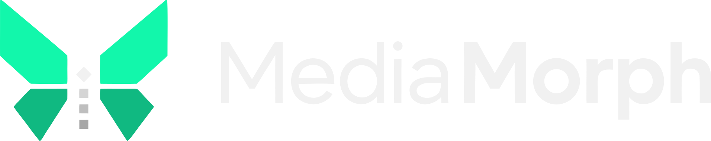
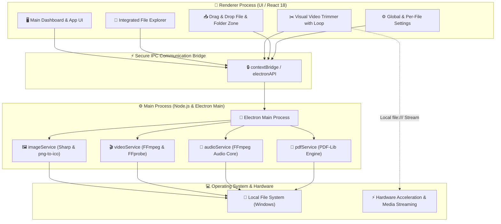

<div align="center">
  <br/>
  <br/>
  
  <br/>
  <br/>
  <p>
    🇺🇸 <strong>English Version</strong> | 🇧🇷 <a href="./README.md">Versão em Português</a>
  </p>
</div>

<br />

## 🌟 Overview

**MediaMorph** is a high-performance, open-source desktop application designed for **batch conversion, compression, video trimming, and manipulation of images, videos, audios, and PDF documents**. Built with **Electron 33**, **React 18**, **TypeScript**, **Tailwind CSS**, **Sharp**, and **FFmpeg**, MediaMorph provides 100% offline, local, and secure multimedia processing with hardware acceleration.

Engineered for creators, developers, designers, and power users, MediaMorph combines an industrial-grade media engine with a clean, responsive interface featuring light/dark themes and a built-in file explorer.

<div align="center">
  
  
  
  
  
  
</div>

---

## 🚀 Key Features

- 🖼️ **Advanced Image Processing:**
  - Lossy and lossless conversion/compression to **WebP, AVIF, JPEG, PNG, GIF, and TIFF**.
  - Native Windows Icon (**`.ico`**) generation with automatic multi-resolution scaling for shortcuts and executables.
  - Social media dimension presets (*Instagram Story 9:16, Feed 1:1, YouTube Thumbnail 16:9, Twitter Banner 3:1, Favicon 32x32*).
  - EXIF metadata stripping and alpha channel transparency preservation.
  - Interactive **Before vs After** comparison modal (*Split Slider*) with real-time file size savings calculation.

- 🎬 **Video Optimization & Visual Trimmer:**
  - High-efficiency encoding powered by **FFmpeg** for **MP4 (H.264), WebM (VP9), MKV, animated GIF**, or audio extraction to **MP3**.
  - Target file size compression presets (*Discord 25MB/8MB, WhatsApp 16MB, 50MB*) and manual Constant Rate Factor (*CRF 18-35*) controls.
  - **Integrated Visual Trimmer:** Dual-handle timeline scrubber with continuous loop playback constrained strictly to the selected cut.
  - One-click audio stripping for muted video export.

- 🎵 **Audio Processing:**
  - Support for **MP3, WAV, FLAC, AAC, and OGG**.
  - Custom bitrate controls (128k - 320k), stereo/mono channel mixing, and dynamic volume normalization.

- 📄 **PDF Document Compiler:**
  - Merge and compile multiple image files into a single high-definition PDF document with custom page compression.

- 📂 **Integrated File Explorer:**
  - Direct in-app directory browsing with system shortcuts (*Downloads, Pictures, Videos, Documents, Desktop, Local Drive C:*).
  - One-click recursive whole-folder imports into the processing queue.

- 🌓 **Light & Dark Theme Support:**
  - Responsive, eye-friendly design (`#161616` dark background and `#f1f1f1` light background) styled with `#10B981` and `#12F7AB` brand accents.

---

## 🛠️ Tech Stack

<div align="center">
  
  
  
  
  
  
  
  
  
  
  
  
</div>

---

## 🏛️ System Architecture

MediaMorph adopts a modular layered architecture, decoupling the UI rendering layer from native backend worker services via IPC (*Inter-Process Communication*):



---

## 📊 Supported Formats & Capabilities

| Media Type | Input Formats | Output Formats | Capabilities |
| :--- | :--- | :--- | :--- |
| **Images** | PNG, JPG, JPEG, WebP, AVIF, TIFF, GIF, SVG, BMP, ICO | WebP, AVIF, JPEG, PNG, GIF, TIFF, ICO | Scale/dimension resize, social presets, EXIF removal, lossless mode, `.ico` generator. |
| **Videos** | MP4, MKV, MOV, AVI, WebM, FLV, WMV, M4V, 3GP | MP4 (H.264), WebM (VP9), MKV, GIF, MP3 | CRF compression, target size limit (Discord/WhatsApp), 1080p/720p/480p/360p downscaling, visual trimmer, audio muting. |
| **Audio** | MP3, WAV, FLAC, AAC, OGG, M4A, WMA | MP3, WAV, FLAC, AAC, OGG | Bitrate adjustment (128k - 320k), stereo/mono mixing, volume normalization. |
| **Documents**| PNG, JPG, JPEG, WebP, AVIF, TIFF | PDF (.pdf) | Multi-image compilation, custom page ordering, adjustable quality. |

---

## 📦 Installation & Setup

### Prerequisites

* [Node.js](https://nodejs.org/) v18.0.0 or higher
* [NPM](https://www.npmjs.com/) (included with Node.js)

### 1. Clone the Repository

```bash
git clone https://github.com/gui-bus/MediaMorph.git
cd MediaMorph
```

### 2. Install Dependencies

```bash
npm install
```

### 3. Run in Development Mode

```bash
npm run dev
```

### 4. Build and Package Executable (`.exe`)

```bash
# Compiles TypeScript, Vite bundle, Electron binaries and applies official icon resource
npm run build:exe
```

The standalone production executable will be created at:
📂 **`release/1.0.0/win-unpacked/MediaMorph.exe`**

---

## 📑 Available Scripts

* `npm run dev`: Starts the Vite dev server and launches the Electron application window.
* `npm run build`: Compiles the frontend and packages the base Electron build.
* `npm run build:frontend`: Runs type checking with `tsc` and builds production assets via Vite.
* `npm run build:exe`: Compiles and packages the Windows executable (`.exe`) with official icon patching.
* `npm run strip-comments`: Automatically strips source-code comments for clean production deployments.

---

## 📄 License

This project is licensed under the **MIT License**. See the [LICENSE](./LICENSE) file for more details.

---

<div align="center">
  Built with 💚 by <a href="https://github.com/gui-bus">Guilherme Bustamante</a>
</div>
