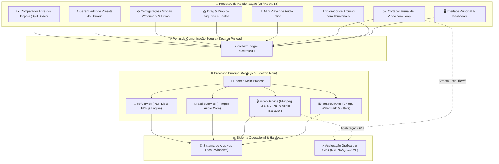

<div align="center">
  <br/>
  <br/>
  
  <br/>
  <br/>
  <p>
    🇺🇸 <a href="./README.en.md">English Version</a> | 🇧🇷 <strong>Versão em Português</strong>
  </p>
</div>

<br />

## 🌟 Visão Geral

O **MediaMorph** é um aplicativo desktop open-source de alta performance para **conversão, compressão, corte, marca d'água e manipulação em lote de imagens, vídeos, áudios e documentos PDF**. Desenvolvido com **Electron 33**, **React 18**, **TypeScript**, **Tailwind CSS**, **Sharp** e **FFmpeg**, o MediaMorph oferece processamento 100% local, seguro e offline com aceleração nativa por hardware (GPU).

Projetado para criadores de conteúdo, desenvolvedores, designers e usuários exigentes, o MediaMorph une um motor de renderização multimídia de padrão industrial a uma interface moderna, responsiva, com suporte completo a temas claro/escuro e um explorador de arquivos integrado nativo.

<div align="center">
  
  
  
  
  
  
</div>

---

## ⚡ O Que Você Pode Fazer com o MediaMorph

Abaixo está o catálogo completo de todas as funcionalidades, operações e manipulações disponíveis:

### 🖼️ 1. Imagens & Ícones
- **Conversão e Compressão Multiformato:** Converta entre **PNG, JPG/JPEG, WebP, AVIF, GIF, TIFF, BMP, SVG e ICO**.
- **Marca d'Água em Lote (Watermark):**
  - Aplicação de **Texto** personalizado ou **Logotipo PNG** transparente.
  - Controle de opacidade (10% a 100%), tamanho e posicionamento (*Centro, Cantos Superior/Inferior Esquerdo e Direito*).
- **Filtros e Ajustes de Cor:**
  - Sliders em tempo real de **Brilho**, **Contraste**, **Saturação** e **Nitidez** (*Sharpen*).
  - Rotação rápida (90°, 180°, 270°) e Espelhamento (*Flip Horizontal / Vertical*).
- **Rasterização Avançada de Vetores (SVG):** Renderize SVGs com multiplicador de densidade de ultra-alta resolução (1x, 2x, 4x, 8x).
- **Compressão com Perdas (*Lossy*) ou Sem Perdas (*Lossless*):** Controle deslizante de qualidade visual de 1 a 100% ou compressão matemática sem perda de qualidade.
- **Gerador Nativo de Ícones Windows (`.ico`):** Transforme qualquer imagem em um arquivo de ícone de múltiplas camadas (256x256, 128x128, 64x64, 48x48, 32x32, 16x16) para executáveis e atalhos.
- **Redimensionamento por Escala e Resolução:** Redimensionamento percentual livre ou presets de redes sociais (*Instagram Story 9:16, Feed 1:1, YouTube Thumbnail 16:9, Twitter Banner 3:1, Favicon 32x32*).
- **Remoção de Metadados EXIF:** Exclua dados sensíveis de localização GPS, modelo da câmera e data/hora para proteger sua privacidade.
- **Comparador Antes & Depois (*Split Slider*):** Visualize as imagens original e comprimida lado a lado com divisor interativo, zoom e porcentagem de economia de espaço em tempo real.

---

### 🎬 2. Vídeos & Animações
- **Conversão de Alta Eficiência:** Converta vídeos entre **MP4 (H.264), WebM (VP9), MKV, AVI, MOV, FLV, WMV, M4V e 3GP**.
- **Aceleração por Hardware GPU:** Suporte a codificação acelerada por placa de vídeo (**NVIDIA NVENC**, **Intel QuickSync** e **AMD AMF**).
- **Controle de FPS & Velocidade (Timelapse / Slow Motion):**
  - Taxa de quadros: *Manter Original, 60 FPS, 30 FPS, 24 FPS*.
  - Velocidade: *0.5x (câmera lenta), 1.0x (normal), 1.5x, 2.0x, 4.0x (timelapse rápido)* com ajuste automático de pitch de áudio.
- **Enquadramento & Crop de Proporção:** Recorte automático de enquadramento para *9:16 Vertical (Reels/Shorts/TikTok), 1:1 Quadrado, 16:9 Panorâmico ou 4:5 Retrato*.
- **Gerador de GIF Animado:** Transforme qualquer trecho de vídeo em um GIF animado leve e fluido.
- **Extração de Áudio Multiformato:** Extraia o som de qualquer vídeo direto para **MP3, WAV, FLAC, AAC ou OGG**.
- **Modos Inteligentes de Limitação de Tamanho:**
  - *Discord Free (Limite de 25 MB ou 8 MB)*
  - *WhatsApp (Limite de 16 MB)*
  - *Email / Anexo Rápido (Limite de 50 MB)*
- **Controle de Compressão CRF (*Constant Rate Factor*):** Ajuste fino de taxa de bits entre CRF 18 (qualidade de estúdio) e CRF 35 (máxima economia de espaço).
- **Redimensionamento de Vídeo:** Downscaling inteligente para *4K (2160p), Full HD (1080p), HD (720p), SD (480p) e 360p*.
- **Cortador Visual Integrado (*Video Trimmer*):** Régua interativa de linha do tempo com ajuste fino de ponto inicial e final, pré-visualização contínua e reprodução em loop estritamente no trecho selecionado.
- **Remoção de Áudio com 1 Clique:** Exporte vídeos totalmente mudos (*Mute*) para redes sociais ou apresentações.
- **Miniaturas (*Thumbnails*) Automáticas:** Captura instantânea de frame visual para visualização rápida no explorador e na fila.

---

### 🎵 3. Áudios & Músicas
- **Conversão de Áudio:** Suporte completo para **MP3, WAV, FLAC, AAC, OGG, M4A, WMA e AIFF**.
- **Mini Audio Player Integrado:** Dê play e ouça prévias de áudio diretamente nos cards da fila e no explorador de arquivos antes de converter.
- **Controle de Taxa de Bits (*Bitrate*):** Seleção de qualidade entre *128 kbps, 192 kbps, 256 kbps e 320 kbps*.
- **Mixagem de Canais:** Alterne entre áudio **Estéreo** e **Mono**.
- **Normalização de Volume Dinâmica:** Nivele faixas de áudio baixas ou com picos excessivos automaticamente.

---

### 📄 4. Documentos PDF
- **Imagens ➔ PDF Único:** Combine e compile dezenas de imagens em um único arquivo PDF de alta definição com ordenação flexível e compressão visual ajustável.
- **PDF ➔ Extração de Páginas em Imagens:** Carregue qualquer arquivo PDF e extraia cada página individualmente como imagem nos formatos **WebP, PNG, JPEG, AVIF ou TIFF** com escala de 150 a 450 DPI.
- **Mesclar Múltiplos PDFs (Merge PDF):** Una múltiplos arquivos PDF em um único documento contínuo na ordem da fila.
- **Dividir e Extrair Páginas de PDF (Split PDF):** Especifique intervalos de páginas (ex: `1-5`, `3, 7-10`) para gerar novos documentos parciais.

---

### 📂 5. Produtividade, Renomeação & Presets
- **Renomeador Inteligente em Lote:** Defina regras de nomenclatura dinâmica usando tags como `{name}`, `{date}`, `{counter}` e `{ext}`.
- **Gerenciador de Predefinições do Usuário (Custom Presets):** Salve e carregue suas combinações favoritas de configurações com 1 clique.
- **Pausar & Retomar Fila:** Pause conversões pesadas e retome quando quiser sem perder o progresso.
- **Explorador de Arquivos Integrado:** Navegue pelo disco rígido sem sair do app, com atalhos rápidos (*Downloads, Desktop, Imagens, Vídeos, Documentos, Disco C:*).
- **Importação de Pastas Inteiras:** Selecione uma pasta e deixe o MediaMorph varrer recursivamente todas as mídias compatíveis para a fila com um único clique.
- **Estatísticas Históricas de Economia:** Painel com total de arquivos convertidos, tempo economizado e gigabytes liberados.
- **100% Local & Seguro:** Nenhum arquivo é enviado para servidores externos ou nuvem.

---

## 🛠️ Stack Tecnológica

<div align="center">
  
  
  
  
  
  
  
  
  
  
  
  
  
  
  
  
</div>

---

## 🏛️ Arquitetura do Sistema



---

## 📊 Tabela de Formatos & Operações

| Mídia | Formatos de Entrada | Formatos de Saída | Principais Capacidades |
| :--- | :--- | :--- | :--- |
| **Imagens** | PNG, JPG, JPEG, WebP, AVIF, TIFF, GIF, SVG, BMP, ICO | WebP, AVIF, JPEG, PNG, GIF, TIFF, ICO | Marca d'água (texto/logo), filtros de cor (brilho/contraste/saturação/nitidez), rotação/espelho, densidade SVG, presets sociais, EXIF removal, `.ico` multicamadas. |
| **Vídeos** | MP4, MKV, MOV, AVI, WebM, FLV, WMV, M4V, 3GP | MP4, WebM, MKV, GIF, MP3, WAV, FLAC, AAC, OGG | Aceleração por GPU (NVENC/QSV/AMF), FPS (24/30/60), velocidade (0.5x-4x), crop (9:16, 1:1, 16:9), corte visual interativo, limite em MB. |
| **Áudios** | MP3, WAV, FLAC, AAC, OGG, M4A, WMA, AIFF | MP3, WAV, FLAC, AAC, OGG | Mini audio player integrado, taxa de bits personalizada (128k - 320k), mixagem estéreo/mono, normalização de volume. |
| **Documentos PDF** | PNG, JPG, JPEG, WebP, AVIF, TIFF, PDF | PDF (.pdf), WebP, PNG, JPEG, AVIF, TIFF | União de fotos em PDF único, extração de páginas em imagens (150 - 450 DPI), mesclagem de múltiplos PDFs, divisão de páginas. |

---

## 📦 Instalação & Execução Local

### Pré-requisitos

* [Node.js](https://nodejs.org/) versão 18.0.0 ou superior
* [NPM](https://www.npmjs.com/) (incluso no Node.js) ou gerenciador de pacotes equivalente

### 1. Clonar o Repositório

```bash
git clone https://github.com/gui-bus/MediaMorph.git
cd MediaMorph
```

### 2. Instalar Dependências

```bash
npm install
```

### 3. Executar em Modo de Desenvolvimento

```bash
npm run dev
```

### 4. Compilar e Gerar o Executável (`.exe`)

```bash
# Compila o TypeScript, o bundle do Vite, os binários do Electron e gera o executável portátil
npm run build
```

O executável standalone pronto para uso será gerado na pasta:
📂 **`release/1.0.0/MediaMorph-Portable-1.0.0.exe`**

---

## 📑 Scripts Disponíveis

* `npm run dev`: Inicia o servidor de desenvolvimento Vite e abre a janela do Electron.
* `npm run build`: Compila o frontend e cria o executável standalone do Electron via electron-builder.
* `npm run build:frontend`: Realiza a checagem de tipos com `tsc` e compila os assets estáticos via Vite.
* `npm run build:exe`: Compila e empacota o executável Windows com ícone oficial.
* `npm run strip-comments`: Remove automaticamente comentários do código-fonte para builds de produção limpos.

---

## 📄 Licença

Este projeto é distribuído sob a licença **MIT**. Consulte o arquivo [LICENSE](./LICENSE) para mais detalhes.
