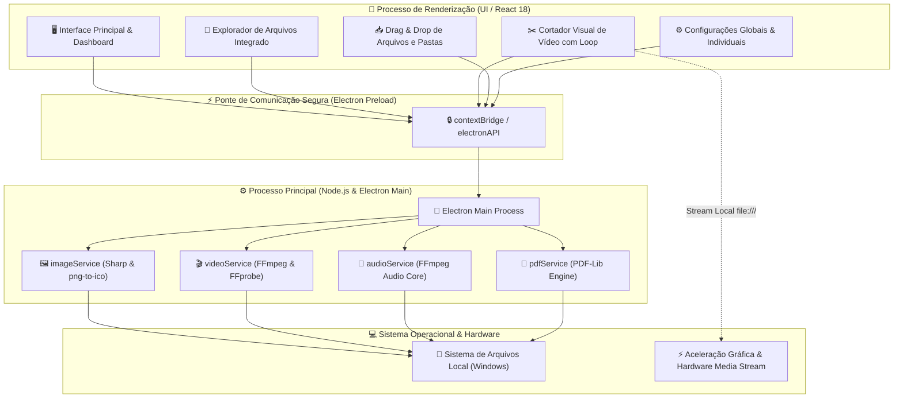

<div align="center">
  <br/>
  <br/>
  
  <br/>
  <br/>
  <p>
    🇺🇸 <a href="./README.en.md">English Version</a> | 🇧🇷 <strong>Versão em Português</strong>
  </p>
</div>

<br />

## 🌟 Visão Geral

O **MediaMorph** é um aplicativo desktop open-source de alta performance para **conversão, compressão, corte e manipulação em lote de imagens, vídeos, áudios e documentos PDF**. Desenvolvido com **Electron 33**, **React 18**, **TypeScript**, **Tailwind CSS**, **Sharp** e **FFmpeg**, o MediaMorph oferece processamento 100% local, seguro e offline com aceleração nativa por hardware.

Projetado para criadores de conteúdo, desenvolvedores, designers e usuários exigentes, o MediaMorph une um motor de renderização multimídia de padrão industrial a uma interface moderna, responsiva, com suporte completo a temas claro/escuro e um explorador de arquivos integrado nativo.

<div align="center">
  
  
  
  
  
  
</div>

---

## 🚀 Principais Recursos

- 🖼️ **Processamento Avançado de Imagens:**
  - Conversão e compressão com perdas (*lossy*) ou sem perdas (*lossless*) para **WebP, AVIF, JPEG, PNG, GIF e TIFF**.
  - Geração nativa de arquivos de ícone do Windows (**`.ico`**) com redimensionamento automático para atalhos e executáveis.
  - Redimensionamento inteligente com presets de redes sociais (*Instagram Story 9:16, Feed 1:1, YouTube Thumbnail 16:9, Twitter Banner 3:1, Favicon 32x32*).
  - Remoção opcional de metadados EXIF e preservação de canal alfa/transparência.
  - Visualizador interativo comparativo **Antes vs Depois** (*Split Slider*) com cálculo de redução de peso em tempo real.

- 🎬 **Otimização de Vídeo & Cortador Visual:**
  - Codificação de alta eficiência com **FFmpeg** para **MP4 (H.264), WebM (VP9), MKV, GIF animado** ou extração direta da faixa de áudio em **MP3**.
  - Modos inteligentes de limitação de tamanho para uploads rápidos (*Discord 25MB/8MB, WhatsApp 16MB, 50MB*) ou controle manual de taxa de compressão (*CRF 18-35*).
  - **Cortador Visual Integrado:** Régua com sliders interativos de ponto inicial e final, pré-visualização contínua com reprodução em loop estritamente no trecho selecionado.
  - Opção para remover faixa de áudio e silenciar vídeos com 1 clique.

- 🎵 **Conversão e Tratamento de Áudio:**
  - Suporte a **MP3, WAV, FLAC, AAC e OGG**.
  - Controle de taxa de bits (bitrate), mixagem de canais (*Estéreo/Mono*) e normalização dinâmica de volume.

- 📄 **Compilador de Documentos PDF:**
  - Junção e união de múltiplas imagens em lote em um único arquivo PDF de alta definição com ordenação flexível e compressão de páginas.

- 📂 **Explorador de Arquivos Integrado:**
  - Navegação nativa em árvore pelo disco rígido e atalhos rápidos de sistema (*Downloads, Imagens, Vídeos, Documentos, Desktop, Disco C:*).
  - Importação de pastas inteiras com detecção recursiva de mídias suportadas.

- 🌓 **Temas Claro e Escuro:**
  - Interface responsiva adaptável com contraste balanceado (`#161616` para tema escuro e `#f1f1f1` para tema claro), personalizada na identidade visual `#10B981` e `#12F7AB`.

---

## 🛠️ Stack Tecnológica

<div align="center">
  
  
  
  
  
  
  
  
  
  
  
  
  
  
  
</div>

---

## 🏛️ Arquitetura do Sistema

O MediaMorph adota uma arquitetura modular em camadas, desacoplando o processo de renderização da interface do motor de processamento nativo via IPC (*Inter-Process Communication*):



---

## 📊 Formatos & Operações Suportadas

| Mídia | Formatos de Entrada | Formatos de Saída | Principais Capacidades |
| :--- | :--- | :--- | :--- |
| **Imagens** | PNG, JPG, JPEG, WebP, AVIF, TIFF, GIF, SVG, BMP, ICO | WebP, AVIF, JPEG, PNG, GIF, TIFF, ICO | Redimensionamento por escala/dimensão, presets sociais, remoção de EXIF, modo lossless, geração de `.ico`. |
| **Vídeos** | MP4, MKV, MOV, AVI, WebM, FLV, WMV, M4V, 3GP | MP4 (H.264), WebM (VP9), MKV, GIF, MP3 | Compressão por CRF, limite em MB (Discord/WhatsApp), redimensionamento para 1080p/720p/480p/360p, corte visual interativo, mutar áudio. |
| **Áudios** | MP3, WAV, FLAC, AAC, OGG, M4A, WMA | MP3, WAV, FLAC, AAC, OGG | Ajuste de bitrate (128k - 320k), mixagem estéreo/mono, normalização de volume. |
| **Documentos**| PNG, JPG, JPEG, WebP, AVIF, TIFF | PDF (.pdf) | Junção de múltiplas imagens em documento único, ordenação de páginas, compressão ajustável. |

---

## 📦 Instalação & Execução Local

### Pré-requisitos

* [Node.js](https://nodejs.org/) versão 18.0.0 ou superior
* [NPM](https://www.npmjs.com/) (incluso no Node.js) ou gerenciador de pacotes equivalente

### 1. Clonar o Repositório

```bash
git clone https://github.com/gui-bus/MediaMorph.git
cd MediaMorph
```

### 2. Instalar Dependências

```bash
npm install
```

### 3. Executar em Modo de Desenvolvimento

```bash
npm run dev
```

### 4. Compilar e Gerar o Executável (`.exe`)

```bash
# Compila o TypeScript, o bundle do Vite, os binários do Electron e aplica o ícone oficial
npm run build:exe
```

O executável standalone pronto para uso será gerado na pasta:
📂 **`release/1.0.0/win-unpacked/MediaMorph.exe`**

---

## 📑 Scripts Disponíveis

* `npm run dev`: Inicia o servidor de desenvolvimento Vite e abre a janela do Electron.
* `npm run build`: Compila o frontend e cria o pacote base do Electron.
* `npm run build:frontend`: Realiza a checagem de tipos com `tsc` e compila os assets estáticos via Vite.
* `npm run build:exe`: Compila e empacota o executável Windows (`.exe`) com ícone oficial injetado via `rcedit`.
* `npm run strip-comments`: Remove automaticamente comentários do código-fonte para builds de produção limpos.

---

## 📄 Licença

Este projeto é distribuído sob a licença **MIT**. Consulte o arquivo [LICENSE](./LICENSE) para mais detalhes.

